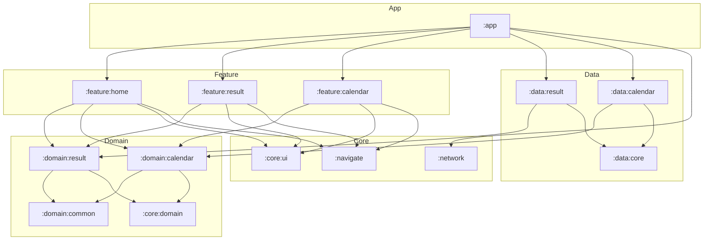

# 🏎️ F1C

**Formula 1 경기 결과와 일정을 한눈에 볼 수 있는 Android 앱**

멀티모듈 + 클린 아키텍처 + MVI(Orbit) 기반으로 설계한 개인 프로젝트입니다.

## 주요 기능

| 화면 | 설명 |
|---|---|
| **홈** | 다가오는 다음 세션 정보와 가장 최근에 끝난 레이스의 결과 요약을 보여줍니다 |
| **세션 결과** | 시즌/라운드별 세션 순위, Top 3 패스티스트 랩 드라이버, 레이스 요약을 탭으로 제공합니다 |
| **캘린더** | 월별 캘린더에서 F1 세션 일정을 확인할 수 있습니다 |

## 기술 스택

| 분류 | 사용 기술 |
|---|---|
| **UI** | Jetpack Compose (Single Activity), Material 3, Compose Shimmer(로딩 스켈레톤), Coil |
| **아키텍처** | 멀티모듈, 클린 아키텍처(feature / domain / data 레이어 분리), MVI ([Orbit](https://orbit-mvi.org/)) |
| **DI** | Hilt |
| **네트워크** | Retrofit2, OkHttp3(Logging Interceptor), Gson |
| **내비게이션** | Navigation Compose — `@Serializable` sealed interface 기반 type-safe 라우팅 |
| **언어** | Kotlin 2.0, Kotlinx Serialization |

## 모듈 구조



| 모듈 | 역할 |
|---|---|
| `:app` | 앱 진입점. 각 feature 화면을 NavHost로 조립하고 Hilt 그래프를 구성 |
| `:feature:*` | 화면(Compose UI) + ViewModel(Orbit MVI). domain의 UseCase만 바라봄 |
| `:domain:*` | 순수 Kotlin 비즈니스 레이어 — 모델, Repository **인터페이스**, UseCase |
| `:domain:common` | 여러 도메인이 공유하는 모델 (`Driver`, `Session`, `SessionType`) |
| `:core:domain` | 공통 결과 래퍼 `ResResult` (성공/실패 처리 체이닝) |
| `:data:*` | Repository 구현체, Retrofit API, DTO ↔ 도메인 매핑 |
| `:data:core` | 서버 공통 응답 포맷 `F1CServerResponse` |
| `:network` | Retrofit/OkHttp 클라이언트 설정 모듈 |
| `:navigate` | 화면 라우트 정의 (`NavScreens`) — feature 간 직접 의존 없이 화면 이동 |
| `:core:ui` | 공통 컴포넌트(TopBar, LoadingView), 테마(Colors, Typo), 유틸 |

### 의존성 규칙

- **feature → domain ← data**: feature와 data는 서로를 모르고 domain의 인터페이스로만 연결됩니다 (의존성 역전)
- Repository 인터페이스는 `domain`이 소유하고, 구현체는 `data`가 Hilt로 바인딩합니다
- feature 모듈끼리는 서로 의존하지 않고 `:navigate`의 라우트 정의를 통해서만 이동합니다

## 클린 아키텍처 — UseCase 중심 레이어링

모든 데이터 흐름은 **UseCase**를 거치도록 설계해 클린 아키텍처를 반영했습니다.

```
[Presentation]          [Domain]                      [Data]
ViewModel  ──────→  UseCase ──→ Repository 인터페이스  ←──  RepositoryImpl ──→ DataSource ──→ Retrofit API
                    (비즈니스 로직)   (domain이 소유)          (구현체, DTO → 도메인 모델 매핑)
```

- **ViewModel은 Repository를 직접 알지 못하고 UseCase만 주입**받습니다 — 화면은 "무엇을 하는지"만 알고 "어떻게 가져오는지"는 모릅니다
- UseCase는 `suspend operator fun invoke()` 컨벤션으로 함수처럼 호출됩니다
- UseCase가 결과를 `ResResult<T>`(Success/Error)로 감싸 반환하므로, ViewModel은 try-catch 없이 `onSuccess { } / onError { } / onComplete { }` 체이닝으로 상태를 갱신합니다

```kotlin
class GetLastSessionResultSummaryUseCase @Inject constructor(
    private val resultRepository: ResultRepository   // domain의 인터페이스에만 의존
) {
    suspend operator fun invoke(): ResResult<LastSessionResultSummary> = wrapAsResult {
        resultRepository.getLastSessionSummary()
    }
}
```

- 도메인 레이어(`:domain:*`, `:core:domain`)의 코드는 **Android 프레임워크(UI·Compose)에 의존하지 않는 순수 Kotlin 클래스**로만 구성되어 단위 테스트가 쉽고, 데이터 소스가 바뀌어도(예: 로컬 캐시 추가) feature 코드는 영향을 받지 않습니다

## 아키텍처 — MVI (Orbit)

각 화면은 `ContainerHost<State, SideEffect>`를 구현한 ViewModel이 담당합니다.

```
사용자 액션 → intent { } → UseCase 호출 → reduce { state.copy(...) } → UI 갱신
                                        └→ postSideEffect(...) → 네비게이션 등 1회성 이벤트
```

- **State**: 화면의 모든 상태를 하나의 불변 data class로 관리
- **SideEffect**: 네비게이션 등 1회성 이벤트 분리
- 로딩 상태는 상태 플래그로 관리하고, Shimmer 스켈레톤 UI로 표현

## 프로젝트 구조 (feature 예시)

```
feature/result/
├── SessionResultScreen.kt      # Compose UI
├── SessionResultViewModel.kt   # Orbit ContainerHost
├── SessionResultState.kt       # 화면 상태
├── SessionResultSideEffect.kt  # 1회성 이벤트
└── components/                 # 화면 전용 컴포넌트
```
